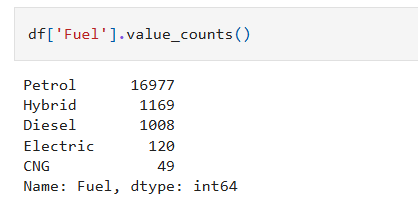

# 🧹 Data Cleaning, Preprocessing & Model Selection (Random Forest-Based)

This project focuses on building a robust machine learning pipeline that:
1. Cleans raw data
2. Performs preprocessing
3. Applies multiple ML models
4. Selects the best model based on performance (Random Forest)

---

## 📁 Project Phases

### 1. 🧼 Data Cleaning

- Removed duplicates
- Handled missing/null values
- Fixed inconsistent formatting
- Converted data types where necessary

### 2. ⚙️ Data Preprocessing

- Label encoding or one-hot encoding for categorical variables
- Feature scaling (MinMaxScaler / StandardScaler)
- Feature selection (optional)
- Train-test split (e.g. 80-20)

---

## 🤖 Models Used

The following machine learning models were applied and evaluated:

| Model               | Notes                            |
|--------------------|----------------------------------|
| Logistic Regression | Baseline model                   |
| Decision Tree       | Simple tree-based classifier     |
| K-Nearest Neighbors | Distance-based classifier        |
| Support Vector Machine | Good with smaller feature sets |
| **Random Forest**   | 🏆 Best performer (high accuracy, low overfitting) |
| XGBoost             | Boosted tree ensemble            |
| Naive Bayes         | Simple probabilistic classifier  |

---

## ✅ Best Performing Model: Random Forest

Random Forest achieved the best results in terms of:

- Accuracy
- F1 Score
- Generalization to test data

> Random Forest was chosen as the final model for deployment.

---

## 📊 Evaluation Metrics

Each model was evaluated using:

- Accuracy
- Precision
- Recall
- F1-Score
- Confusion Matrix
- Cross-validation (k=5)

Example output for Random Forest:

